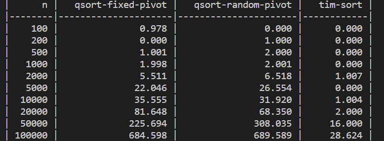

# CMPS 2200 Reciation 5
## Answers

**Name:** Cameron McLaren

Place all written answers from `recitation-05.md` here for easier grading.

- **1b.**

Fixed qsort implementation seems to perform better with the highest n values at n=100000 as well as the other high values, with the exception of n=50000. The difference at the highest level especially is the most drastic. At the lowest levels from n=100 to n=1000, the values were more similar and the random sort actually took less time, but on a much smaller scale. This relates to the asymptotic bounds because the worst case for quicksorting with a random pivot is O(n^2) and the worst complexity of a fixed pivot is O(nlogn). This is in line with the values which were also plotted on the graph above, with the red dots being the data from a fixed pivot and the blue being from the random pivot. The fixed pivot and random pivot both curve sharply upward, but the random takes on a larger curve than the fixed pivot which is in line with their worst case time complexities. It is clear that as the list grows exponentially, so too does the time it takes to sort, which is what we would expect from the time complexities.

- **1c.**
Timsort is the most efficient. Timsort has an asymptotic runtime of O(nlogn), which is faster than the runtimes of quicksort has an asymptotic runtime of O(n^2)

